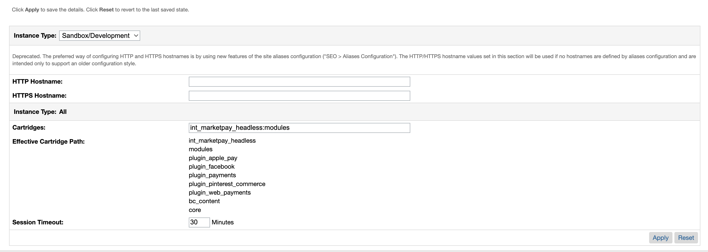
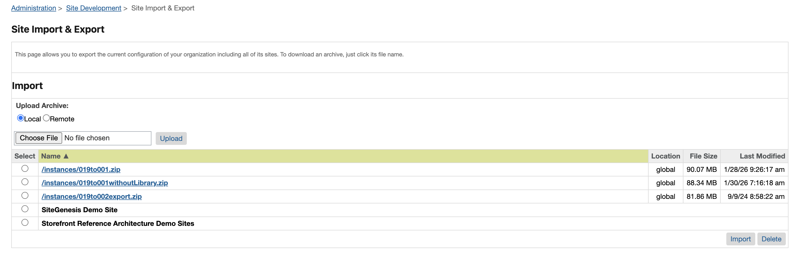
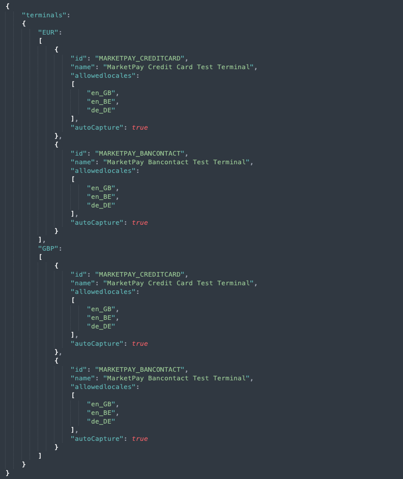
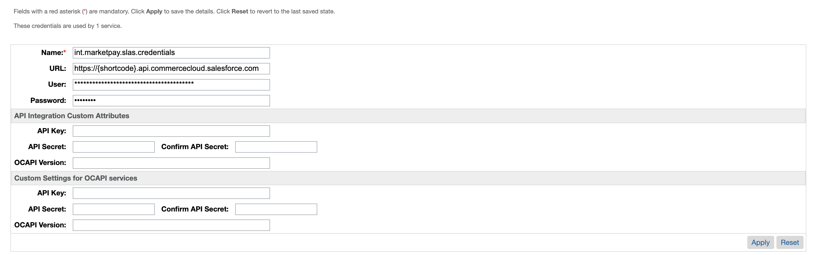
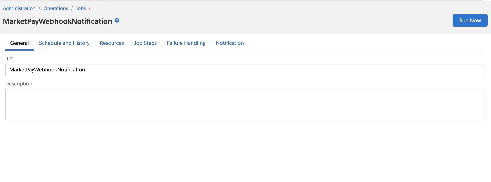
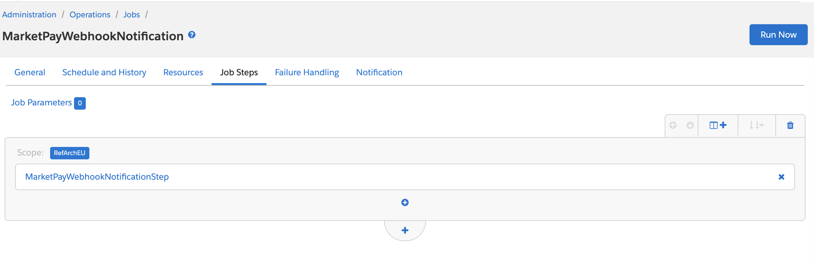
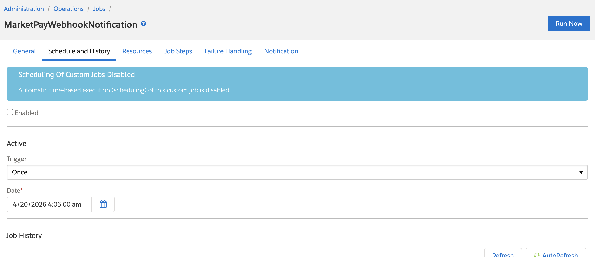
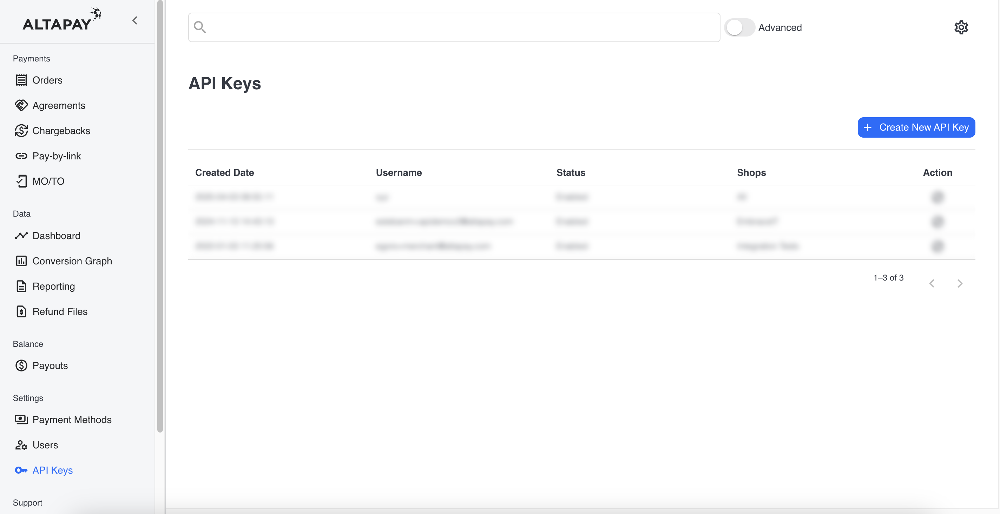
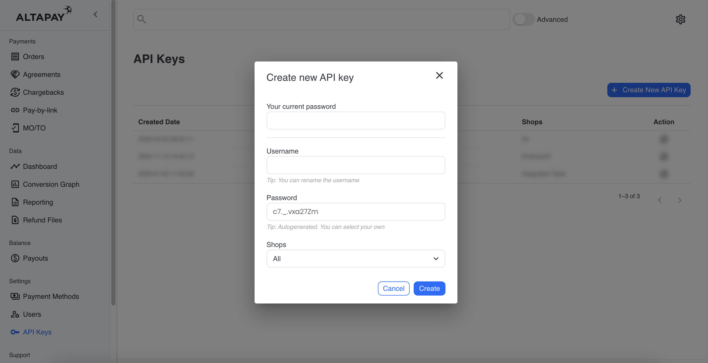

# AltaPay for Salesforce Composable Storefront PWA

This plugin enables **AltaPay** as the Payment Service Provider (PSP) for storefronts using the Salesforce Composable Storefront PWA.

**Table of Contents**

[Prerequisites](#prerequisites)

[Installation](#installation)

- [Upload Cartridge](#upload-cartridge)

- [Business Manager Configuration](#business-manager-configuration)

- [Import MarketPay Data](#import-marketpay-data)

[Configuration](#configuration)

- [Credentials](#credentials)

- [Services Configuration](#services-configuration)

- [Jobs Configuration](#jobs-configuration)

- [Get MarketPay Payment Status](#get-marketpay-payment-status)

[Mobile App Payment Flows](#mobile-app-payment-flows)

- [Web-Based App Flow](#web-based-app-flow)

- [Native App Flow](#native-app-flow)

## Prerequisites

Before configuring the cartridges, you need the below information. These can
be provided by AltaPay.

1.  AltaPay credentials:
    -   Username
    -   Password
2.  AltaPay gateway information:
    -   AltaPay Terminal Configuration JSON: Used for mapping payment methods in Salesforce to terminals in the AltaPay payment gateway.
    -   Gateway

> **Note:** 
> If the API user credentials have not yet been created, refer to the [Creating a New API User](#creating-a-new-api-user) section for step-by-step instructions.

## Installation

Download the AltaPay for Salesforce Commerce Cloud `int_marketpay_headless` cartridge from [Github](https://github.com/AltaPay/plugin-salesforce) for headless implementation.

Then follow the steps below to complete the installation.

### Upload Cartridge

1. Open the **int_marketpay_headless** cartridge into the VS Code.

2. Add your sandbox credentials to `dw.json` file.

3. Open the Prophet extension.

3. Click on the `Prophet: Clean Project/Upload all` from CARTRIDGES window.

4. The Cartridge extension will upload cartridges to the linked sandbox.

### Business Manager Configuration

1. Log into the **SFCC Business Manager** on your sandbox.

2. Navigate to: **Administration** > **Manage Sites** > **[store front site]** > **settings** tab.

9. Add **int_marketpay_headless** cartridge in the cartridge path and click the **Apply** button.

    

### Import MarketPay Data

1. Go to `metadata/MarketPay-Headless/sites` and rename `RefArchGlobal` to match your site ID.

2. Zip `MarketPay-Headless` folder.

3. From the SFCC Business Manager: Navigate to: **Administration** > **Site Development** > **Site Import & Export**.

    

4. Choose file from the **Import** section, click the **Upload** link or button.

Once the import is successful, all the necessary fields will be created in Salesforce to allow our solution to function. You will have configuration fields to set up the environment, as well as payment data fields that help you understand the payment status and provide information necessary for debugging.

## Configuration

From the SFCC Business Manager:

1. Select your site from the list in the top navigation bar.

2. Navigate to: **Merchant Tools** > **Site Preferences** > **Custom Preferences** > **MarketPay**:

3. This is where the merchant can access and configure the MarketPay integration.

4. Fill out the settings as desired. Descriptions of the site preferences are listed in the tables below.

    ### Credentials
    Use the following preferences to configure your AltaPay **credentials**.

    | **Preference** | **Description** |
    |----------------|-----------------|
    | **MarketPay Terminals / Payment Methods** | Mapping of payment methods in Salesforce and terminals in the MarketPay payment gateway.   A terminal can only contain one payment method and one currency, However, it is possible to use the same terminal for multiple payment methods. By sharing your requirements with MarketPay, we will ensure that the correct configuration and JSON mapping are created to meet your needs.      The setting must be structured as shown in the screen illustration.   The attribute **id** must correspond with the payment method added in: **Merchant Tools** > **Ordering** > **Payment Methods** plus the preferred currency. The attribute **name** is the name and identifier of the MarketPay terminal. The attribute **allowedlocales** defines which locales that can use the terminal.    **Note:** The JSON file containing the terminal configuration will be provided by AltaPay. This file defines the mapping between Salesforce payment methods and the terminals configured in the MarketPay payment gateway. |
    | **Organization ID** | To find the organization ID in Business Manager, click App Launcher and then select **Administration** > **Site Development** > **Salesforce Commerce API Settings**. Example: `f_ecom_zzdc_001` |
    | **Short Code** | To find your short code in Business Manager, click App Launcher and then select **Administration** > **Site Development** > **Salesforce Commerce API Settings**. Example: `kv7kzm78` |
    | **Known IP Protection** | Restricts callbacks to known gateway IP addresses. Disable this option if the store is using a firewall or proxy service (such as Cloudflare) |
    | **Payment Success URL** | URL where MarketPay redirects after a successful payment. Example: `https://example.com/{LOCALE}/checkout/confirmation`. The `{LOCALE}` variable is replaced with the store's locale (e.g. `de`, `nl`) |
    | **Payment Failed URL** | URL where MarketPay redirects after a failed payment. Example: `https://example.com/{LOCALE}/checkout/confirmation`. The `{LOCALE}` variable is replaced with the store's locale (e.g. `de`, `nl`) |
    | **App URL** | URL where MarketPay redirects after a successful/failed payment. Example: `exampleapp://{LOCALE}/checkout/confirmation`. The `{LOCALE}` variable is replaced with the store's locale (e.g. `de`, `nl`). Used by the [Web-Based App Flow](#web-based-app-flow) — see [Mobile App Payment Flows](#mobile-app-payment-flows) for the per-checkout alternative. |
    | **App Return URL Allowlist** | Comma-separated list of origins/schemes that a shopper-supplied `c_marketPayAppReturnURL` is allowed to use (see [Native App Flow](#native-app-flow)). For an HTTPS App Link/Universal Link, list the full origin, e.g. `https://m.example.com`. For a custom app protocol, list the scheme, e.g. `merchant-app://`. Any value that isn't listed here is rejected — required to enable Native App Flow. |
    | **Callback Secret** | Secret key used to validate callbacks from AltaPay. Follow [Secret setup](https://documentation.altapay.com/v2/Checkout-API/CallbackSecurity/) to set up the secret. |

### Services Configuration

From the SFCC Business Manager:

1. Navigate to: **Administration** > **Operations** > **Services** > **Service Credentials**

2. Click on **int.marketpay.service.credentials**.

3. Update the URL, replace `https://testgateway.altapaysecure.com` with your gateway URL, and enter Gateway API user and Password and click **Apply** button.

    

4. Click on **int.marketpay.slas.credentials**.

5. Enter the SLAS User and Password and click **Apply** button.

    

### Jobs Configuration

To process notification callback requests, the cartridge provides a custom job step (defined in steptypes.json) with the required logic. The job itself must be configured in Business Manager, where SFCC handles scheduling and execution.

From the SFCC Business Manager:

1. Navigate to: **Administration** > **Operations** > **Jobs**
2. Click on **MarketPayWebhookNotification**.

    

3. Click on **JobSteps**.

    

4. Click Scope and choose your site.
5. Then click **Schedule and History**. 

    

6. Enable and schedule the job (mandatory for processing notifications)

## Get MarketPay Payment Status

You can use the B2C Commerce API’s [getOrder](https://developer.salesforce.com/docs/commerce/commerce-api/references/orders?meta=getOrder) endpoint to retrieve MarketPay payment data (e.g., transaction ID, captured amount, reserved amount, etc.). All MarketPay-related fields are prefixed with `c_marketPay`.

## Mobile App Payment Flows

For merchant apps (e.g. built on Salesforce Composable Storefront / React Native), the cartridge supports two ways of getting the customer back into the app after a payment attempt. Both are opt-in via custom properties on `POST /payment-instruments` (Shopper Baskets API), in addition to `c_marketPayPaymentMethodID`, which is required on every MarketPay payment instrument regardless of platform (web, app, or native):

| **Property** | **Description** |
|--------------|------------------|
| `c_marketPayPlatform` | `"web"` (default) or `"app"`. Setting it to `"app"` enables the [Web-Based App Flow](#web-based-app-flow). |
| `c_marketPayAppReturnURL` | A per-checkout deep link, e.g. `myapp://checkout/return`. Its presence enables the [Native App Flow](#native-app-flow). |

### Web-Based App Flow

Set `c_marketPayPlatform: "app"` on the payment instrument. The payment page (including Bancontact) still renders inside the app's WebView, and after a success or failure MarketPay redirects to the static **App URL** site preference (see [Credentials](#credentials)) — the same URL for every checkout on the site.

### Native App Flow

Set `c_marketPayAppReturnURL` on the payment instrument to a deep link specific to that checkout, e.g. `https://m.example.com/app-return` (recommended — an [App Link](https://developer.android.com/training/app-links)/[Universal Link](https://developer.apple.com/ios/universal-links/) for the best experience when the app isn't installed) or a custom app protocol like `merchant-app://link-to-final-page`, per [AltaPay's callback documentation](https://documentation.altapay.com/v2/Checkout-API/Integration/#configuring-payment-status-callbacks).

> **Security note:** `c_marketPayAppReturnURL` is shopper-supplied, so it's validated against the **App Return URL Allowlist** site preference (see [Credentials](#credentials)) before it's stored — this prevents it being used as an open redirect. You must add your app's origin(s)/scheme(s) to that preference, or the value is silently dropped (checkout still completes, just without Native App Flow) and a warning is logged.

When the order is placed, the cartridge:

- Sends that URL as the session's redirect callback and flags the session with `isNativeFlow: true` (`PUT session/{sessionId}`).
- Lets MarketPay hand control back to the merchant app directly (e.g. via an `AppReturnLink`) instead of routing through SFCC-hosted success/failure pages.

If both `c_marketPayPlatform: "app"` and `c_marketPayAppReturnURL` are supplied, `c_marketPayAppReturnURL` takes precedence and the checkout uses the Native App Flow.

## Creating a New API User

To create a new API user in your AltaPay account, please follow these steps:

- Log in to your AltaPay account.
- From the left menu, navigate to **Settings** > **API Keys**.

    
    
- Click on the **Create New API Key** button from top right corner.
- Fill in the required fields:
    - **Your current password**  
    - **Username**  
    - **Password**  
    - **Assign Shops**
    
    
- After entering the details, click **Create**.

The new credentials can now be used as the API Login and API Password in the AltaPay API Login section.