# AltaPay for Salesforce Commerce Cloud

This plugin enables **AltaPay** as the Payment Service Provider (PSP) for storefronts using the reference architecture (**SFRA**) on the **Salesforce Commerce Cloud (SFCC)** platform.

> **Note:** 
>
> This guide is based on **SFRA**.  
> If you are using **SiteGenesis**, please consult the [AltaPay Salesforce Commerce Cloud (CC) Plugin documentation](https://documentation.altapay.com/Content/Plugins/Salesforce%20CC/1%20SalesForce%20CC%20Plugin.htm).

**Table of Contents**

[Prerequisites](#prerequisites)

[Installation](#installation)

- [Import Cartridge](#import-cartridge)

- [Import Metadata](#import-metadata)

- [Import Web Service](#import-web-service)

- [Create Payment Processor](#create-payment-processor)

- [Import Payment Methods](#import-payment-methods)

[Configuration](#configuration)

- [Credentials](#credentials)

- [Callbacks](#callbacks)

- [Security](#security)

- [Notifications](#notifications)

- [Localization](#localization)

[Customization](#customization)

[Testing](#testing)

[Reconcile Orders](#reconcile-orders)


## Prerequisites

Before configuring the cartridges, you need the below information. These can
be provided by AltaPay.

1.  AltaPay credentials:
    -   Username
    -   Password
2.  AltaPay gateway information:
    -   Terminal
    -   Gateway

> **Note:** 
> If the API user credentials have not yet been created, refer to the [Creating a New API User](#creating-a-new-api-user) section for step-by-step instructions.

## Installation

Download the AltaPay for Salesforce Commerce Cloud cartridges from [Github](https://github.com/AltaPay/plugin-salesforce)

Then follow the steps below to complete the installation.

### Import Cartridge
1. Import the **int_valitor_sfra** cartridge into the SFCC Studio Workspace.

2. Open UX Studio.

3. Click **File** > **Import** > **General** > Existing Projects into Workspace.

4. Browse to the directory where you saved the cartridge.

5. Click **Finish**.

6. Click **OK** when prompted to link the cartridge to the sandbox.

7. Log into the **SFCC Business Manager** on your sandbox or PIG Instance.

8. Navigate to: **Administration** > **Manage Sites** > **[store front site]** > **settings** tab.

9. Add **int_valitor_sfra** plugin in the cartridge path and click the **Apply** button.

    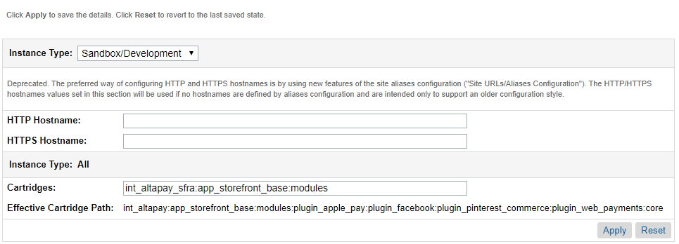

### Import Metadata

From the SFCC Business Manager:

1. Navigate to: **Administration** > **Site Development** > **Import & Export**.

2. In the **Import & Export Files** section, click the **Upload** link or button.

    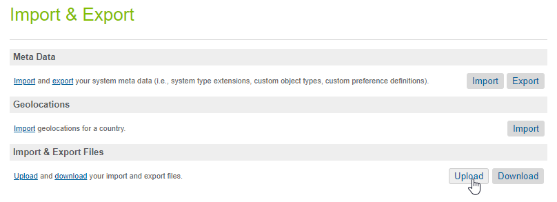

3. Upload the file **valitor_sfra_metadata.xml** from the repository and navigate back.

    

4. In the **Meta Data** section, click the **Import** link or button.

    

5. Select **valitor_sfra_metadata.xml** and click the **Next** button.

6. Wait for validation to complete, and click the **Import** button.


### Import Web Service

AltaPay integration uses the web service framework to create web service calls to AltaPay, so you need to import it into the Sandbox.

From the SFCC Business Manager:

1. Navigate to: **Administration** > **Operations** > **Import & Export**

2. In the **Import & Export Files** section, click the **Upload** link or button.

3. Upload the file **valitor_sfra_webservice.xml** from the repository.

4. In the **Services** section, click the **Import** button.

    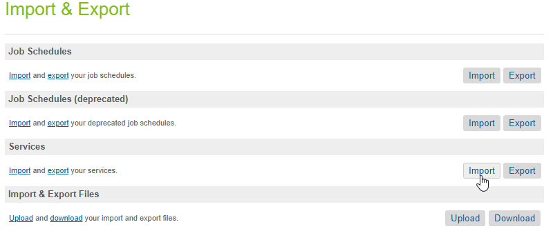

5. Select **valitor_sfra_webservice.xml** and click the **Next** button.

6. Wait for validation and click the **Next** button.

7. Leave **Merge** selected as the import mode and click the **Import** button.

### Create Payment Processor

From the SFCC Business Manager:

1. Select your site from the list in the top navigation bar.

2. Navigate to: **Merchant Tools** > **Ordering** > **Payment Processors**.

3. Click the **New** button.

4. For the ID, enter **ALTAPAY** in all capital letters.

5. For the Description, enter **AltaPay Checkout**.

6. Click the **Apply** button.

    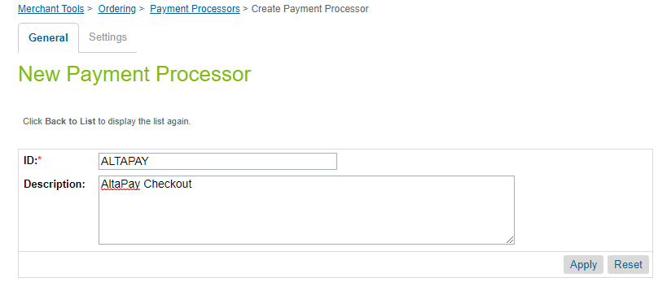

### Import Payment Methods

From the SFCC Business Manager:

1. Select your site from the list in the top navigation bar.

2. Navigate to: **Merchant Tools** > **Ordering** > **Import & Export**

3. In the **Import & Export Files** section, click the **Upload** link or button.

4. Upload the file **valitor_sfra_paymentmethods.xml** from the repository.

5. In the **Payment Methods** section, click the **Import** button.

    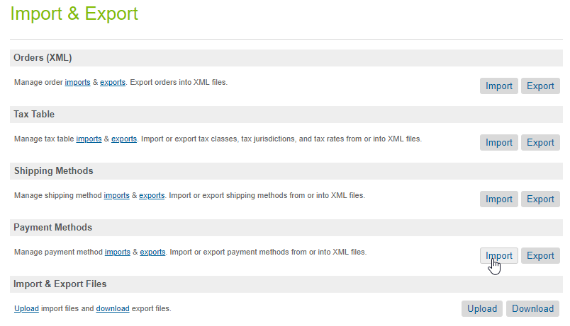

6. Select **valitor_sfra_paymentmethods.xml** and click the **Next** button.

7. Wait for validation and click the **Next** button.

8. Leave **Merge** selected as the import mode and click the **Import** button.

9. Navigate to: **Merchant Tools** > **Ordering** > **Payment Methods**.

10. In the **Payment Methods** section, ensure that all AltaPay payment methods are disabled so they do not appear as an option in the normal Storefront check-out flow.

11. Enable the desired payment methods but be aware that some of them is limited to certain countries and currencies.

12. Remember to disable all the normal storefront payment methods.

    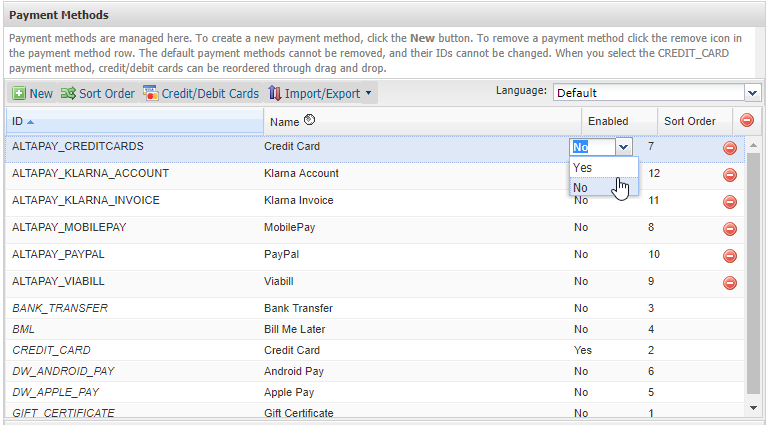

## Configuration

From the SFCC Business Manager:

1. Select your site from the list in the top navigation bar.

2. Navigate to: **Merchant Tools** > **Site Preferences** > **Custom Preferences** > **AltaPay**:

3. This is where the merchant can access and configure the AltaPay integration.

4. Fill out the settings as desired. Descriptions of the site preferences are listed in the tables below.

    ### Credentials
    Use the following preferences to configure your AltaPay **credentials**.

    | **Preference** | **Description** |
    |----------------|-----------------|
    | **AltaPay Cartridge Enabled** | Defines if the AltaPay integration is enabled. |
    | **AltaPay Test Mode** | Defines if the testing mode should be enabled. |
    | **AltaPay base Production URL** | Production gateway URL. e.g. https://yourname.altapaysecure.com/ |
    | **AltaPay base Test URL** | Test gateway URL. e.g. https://testgateway.altapaysecure.com/ |
    | **AltaPay Production Username** | Username for the production gateway and terminals. |
    | **AltaPay Production Password** | Password for the production gateway and terminals. |
    | **AltaPay Test Username** | Username for the test gateway and terminals. |
    | **AltaPay Test Password** | Password for the test gateway and terminals. |
    | **AltaPay Timeout** | Timeout (seconds) for communication with AltaPay backend. <br> **Warning:** Do not change this without consulting AltaPay. |
    | **AltaPay Terminals** | Mapping of payment methods in Salesforce and terminals in the AltaPay payment gateway. <br> A terminal can only contain one payment method and one currency, but it is possible to add all the relevant terminals. <br>  <br> The setting must be structured as shown in the screen illustration. <br> The attribute **id** must correspond with the payment method added in: **Merchant Tools** > **Ordering** > **Payment Methods** plus the preferred currency. The attribute **name** is the name and identifier of the AltaPay terminal. The attribute **allowedlocales** defines which locales that can use the terminal. |

    ---

    ### Callbacks
    Define callback URLs to handle different payment flow events.

    | **Preference** | **Description** |
    |----------------|-----------------|
    | **AltaPay Payment Page URL** | URL for controlling the payment form page which is shown to the customer. It is possible to customize the payment page by changing the callbackform.isml template. |
    | **AltaPay Payment Success URL** | When a payment is accepted, this callback URL is called, and the data received from AltaPay is validated. |
    | **AltaPay Payment Fail URL** | In case a payment fails this callback is called. This can be due to incorrect card details, declined by the bank etc. The data received from AltaPay is stored on the order and the customer is redirected back to checkout page. |
    | **AltaPay Payment Open URL** | To support an asynchronous payment (e.g. wallet payments) where the provider not always accept the payment upfront this callback is called. To indicate this event an open payment contains the confirmation status ‘Not confirmed’. |
    | **AltaPay Payment Notification URL** | In case a payment has not returned an answer (e.g. customer closes window prior to returning to the shop), or when an open payment is accepted/declined. When an answer arrives, this callback is called. This does not apply to card payments. |
    | **AltaPay Redirect Page URL** | This URL is used when the customer is redirected to a third party (e.g. 3D Secure) to inform the customer about the redirection. A default non-branded page is shown if nothing else is stated. |

    ---

    ### Security
    Whitelist trusted AltaPay IPs to ensure secure communication.

    | **Preference** | **Description** |
    |----------------|-----------------|
    | **AltaPay Whitelisted IP's** | List of IP addresses that AltaPay is communicating from. Used to secure that only request from AltaPay is handled. <br> You are advised to verify that the following IP addresses are added: <br> 185.206.120.0/24 (ipv6: 2a10:a200::/29)<br> 185.203.232.129<br> 185.203.233.129 |

    ---

    ### Notifications
    Set up email notifications for error reporting and alerts.

    | **Preference** | **Description** |
    |----------------|-----------------|
    | **AltaPay Error Notifications Enabled** | Preference that defines if notification emails should be send when error events occurs in the payment flow. |
    | **AltaPay Notification Sender** | Email used as sender on notification emails, default is ‘noreply@dsalesforce.com’. |
    | **AltaPay Notification Recipients** | List of notification recipients. |


    ## Localization

    As part of the setup, the language selection for the check-out process is also on the checklist.

    1. Navigate to: **Merchant Tools** > **Site Preferences** > **Locales**.  
    2. Select the web shop’s local language.

        AltaPay supports the following languages:

        | **Code** | **Language** |
        |-----------|---------------|
        | CA | Catalan |
        | CS | Czech |
        | DA | Danish |
        | DE | German |
        | EE* | Estonian – converted to ET |
        | EN | English |
        | ES | Spanish |
        | ET | Estonian |
        | FI | Finnish |
        | FR | French |
        | HR | Croatian |
        | IS | Icelandic |
        | IT | Italian |
        | JA | Japanese |
        | LT | Lithuanian |
        | NB* | Norwegian (Bokmål) – converted to no |
        | NL | Dutch |
        | NN | Norwegian (Nynorsk) – converted to no |
        | NO | Norwegian |
        | PL | Polish |
        | PT | Portuguese |
        | RU | Russian |
        | SK | Slovak |
        | SL | Slovenian |
        | SV | Swedish |
        | TH | Thai |
        | TR | Turkish |
        | ZH | Chinese |

        If you (the merchant) use an unsupported language, the payment page is shown in English as default.

## Customization

We have made some adjustments to the standard SiteGenesis, which you will need to implement to use AltaPay as the Payment Service Provider (PSP) on your storefront.

You will need to modify the following four files:

| **File** | **Location** |
|-----------|---------------|
| **Checkout.js** | app_storefront_base/cartridge/Controllers/Checkout.js |
| **checkout.isml** | app_storefront_base/cartridge/templates/default/checkout/checkout.isml |
| **ALTAPAY.js** | app_storefront_base/hooks.json |
| **package.json** | app_storefront_base/scripts/hooks/payment/processor/ALTAPAY.js |

You will also need to add the following files:

| **File** | **Location** |
|-----------|---------------|
| **hooks.js** | app_storefront_base/client/default/js/altapayCheckout.js |
| **altapayCheckout.js** | Package.json |

### Enabling the AltaPay Cartridge (Checkout.js)
Add the code below to the “Checkout-Begin” controller to activate the cartridge (plugin).

1. Navigate to: **app_storefront_base** > **cartridge** > **Controllers** > **Checkout.js**

2. Insert **altaPayEnabled** property in the rendering object.  

3. Look for an example in the folder **Custom Code**.

    ```javascript
    altaPayEnabled:
    dw.system.Site.current.getCustomPreferenceValue('altaPayCartridgeEnabled')
    ```

    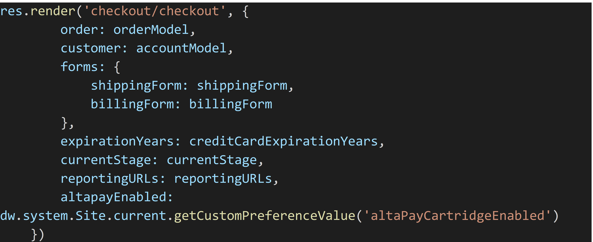

### Using the AltaPay Specific Client JS (checkout.isml)
Add the code below to use the AltaPay specific client JS when the AltaPay cartridge is enabled.

1. Navigate to: **app_storefront_base** > **cartridge** > **templates** > **default** > **checkout** > **checkout.isml**  

2. Insert the AltaPay cartridge enabled check in the top `<isscript>` tag.  

3. Look for an example in the folder **Custom Code**.

    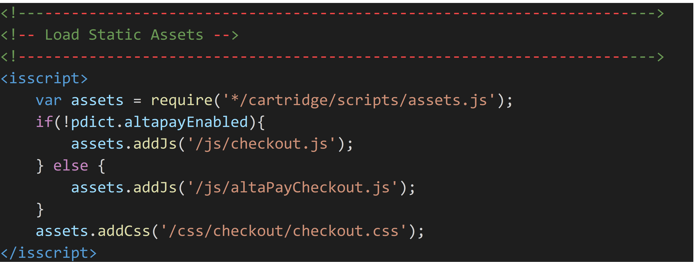

4. Insert altapayCheckout.js file provided in the **Custom Code** folder to **app_storefront_base** > **cartridge** > **client** > **default** > **js**

    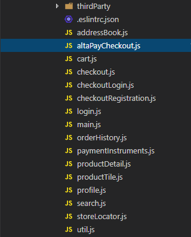

5. Navigate to package.json file in the root folder of your project

6. Insert the “path” configs to package.json.

7. Remember to compile the client JS with this command: npm run compile:js

    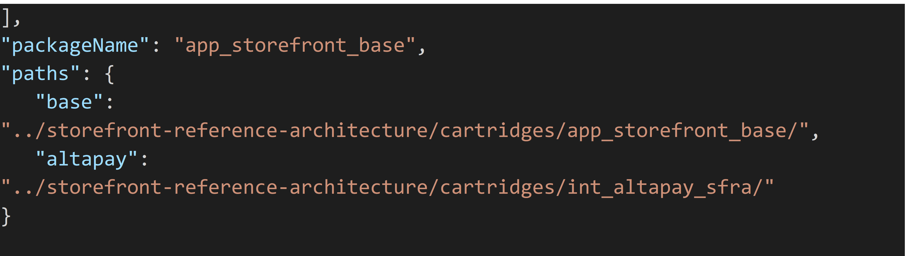

### Adding the AltaPay Processor Hook
Add the code below to add AltaPay as a processor.

1. Navigate to: **app_storefront_base/hooks.json**

2. Insert **AltaPay** below the **basic_credit** processor.

    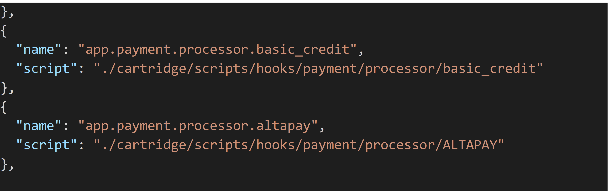

### Inserting the AltaPay Processor

1. Insert the **ALTAPAY processor script** provided in the **Custom Code** folder into:  
   `app_storefront_base -> cartridge -> scripts -> hooks -> processor`

    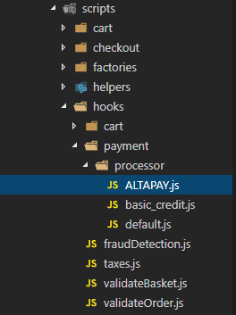

### External Interfaces

The AltaPay cartridge communicates with AltaPay’s backend where customer data, etc. is sent to verify a transaction.  
Banks and acquirers make the verification, and AltaPay relays the response back to the cartridge.

### Credit Card Tokenization

You can save the customer credit card after a successful transaction.  
The credit card number is saved securely inside AltaPay's payments gateway.  
Please contact us to enable the credit card token in your terminal.

The credit card terminal must be configured to support credit card tokens.  
Also, the credit card form template must be set to **form_dynamic_div_with_save_cc**.  
This setup is done inside AltaPay's payments gateway.  
Please contact AltaPay to set up your terminal.

If the terminal is configured correctly, the customer will have the option to save the credit card information during checkout.  
Also, a previously saved credit card will appear with a mask on the checkout page.

## Testing

In general, you can use any card number when testing against the test gateway and they will be accepted.  
A Test bank is also available if the merchant needs to test PayPal, iDEAL, or other alternative payment methods.

**Preconditions for the following test scenarios:**

1. Imported `valitor_sfra_metadata.xml`
   - Updated the ‘Custom Site Preferences’ with AltaPay user with API access rights
   - Added terminals for credit card and/or alternative payment
2. Items available in the storefront
3. The payment method for cards connects with a terminal that is configured to receive cards.  
   An alternative payment method must be connected to a terminal that accepts that payment method.

### Successful Card Payment

1. Add an item to the cart.  
2. Click **View cart.**  
3. When the shopping cart is shown, click on the **Checkout** button.  
4. Select either **Guest checkout** or **Login**.  
   - If guest checkout, fill in the information.  
5. Select shipping method.  
6. Click on **Next: Payment** button.  
7. Fill in remaining information.  
8. Select **Credit Card** as payment method.  
9. Click on **Next: Place Order** button.  
10. The payment page appears. Ensure it is a payment page for card payments.  
11. Enter card details (use random numbers) and click on **Submit** button.  
12. Verify that the confirmation page is shown with correct information and without any error message. Take a note of the order number.  
13. From the SFCC Business Manager navigate to: **Merchant Tools → Ordering → Orders.**  
    Locate and select the order and verify that the order has been handled correctly – **Confirmation Status” = confirmed.**  
14. Log in to [https://testgateway.altapaysecure.com](https://testgateway.altapaysecure.com) and locate the order by the order number via the search box in the top right corner.  
    Check that the amount corresponds with the information in Business Manager and ensure that the status of the payment is **preauth.**

### Failed Card Payment

1. Add an item to the cart.  
2. Click **View cart.**  
3. When the shopping cart is shown, click on the **Checkout** button.  
4. Select either **Guest checkout** or **Login**.  
   - If guest checkout, fill in the information.  
5. Select shipping method.  
6. Click on **Next: Payment** button.  
7. Fill in remaining information.  
8. Select **Credit Card** as payment method.  
9. Click on **Next: Place Order** button.  
10. The payment page appears. Ensure it is a payment page for card payments.  
11. Enter card details – use the following payment information:  
    - **Card number:** 4180000000000566  
    - **Expiry month:** 05  
    - **Expiry year:** 2019  
    - **CVC:** 444  
12. Click on **Submit** button.  
13. Ensure that the user is redirected back to the Checkout flow.  
    Error messages are returned from the AltaPay controller, but the merchant must implement custom functionality to show these messages.  
    See **Requirements** for more details.  
14. From the SFCC Business Manager, navigate to: **Merchant Tools → Ordering → Orders.**  
    Locate and select the order and verify that the order has been handled correctly – **Order Status” = failed.**  
    Take a note of the order number.  
15. Log in to [https://testgateway.altapaysecure.com](https://testgateway.altapaysecure.com) and locate the order by the order number via the search box in the top right corner.  
    Ensure that the status of the order is **preauth_failed.**

### 3D Secure Card Payment

1. Add an item to the cart.  
2. Click **View cart.**  
3. When the shopping cart is shown, click on the **Checkout** button.  
4. Select either **Guest checkout** or **Login**.  
   - If guest checkout, fill in the information.  
5. Select shipping method.  
6. Click on **Next: Payment** button.  
7. Fill in remaining information.  
8. Select **Credit Card** as payment method.  
9. Click on **Next: Place Order** button.  
10. The payment page appears. Ensure it is a payment page for card payments.  
11. Enter card details – use the following payment information:  
    - **Card number:** 4170000000000568  
    - **Expire month:** 05  
    - **Expire year:** 2019  
    - **CVC:** 444  
12. Click on **Submit** button.  
13. The user is redirected to the issuing bank **3D Secure confirmation page**.  
    Enter the correct validation information. If you are testing against the test gateway, a mock-up 3D Secure page is shown.  
    Click **Redirect** button.  
14. Verify that the confirmation page is shown with correct information and without any error message.  
    Take a note of the order number.  
15. From the SFCC Business Manager navigate to: **Merchant Tools → Ordering → Orders.**  
    Locate and select the order and verify that the order has been handled correctly – **Confirmation Status” = confirmed.**  
16. Log in to [https://testgateway.altapaysecure.com](https://testgateway.altapaysecure.com) and locate the order by the order number via the search box in the top right corner.  
    Check that the amount corresponds with the information in Business Manager and ensure that the status of the payment is **preauth** and **3D Secure result** is successful.

### 3D Secure Failed Card Payment

1. Add an item to the cart.  
2. Click **View cart.**  
3. When the shopping cart is shown, click on the **Checkout** button.  
4. Select either **Guest checkout** or **Login**.  
   - If guest checkout, fill in the information.  
5. Select shipping method.  
6. Click on **Next: Payment** button.  
7. Fill in remaining information.  
8. Select **Credit Card** as payment method.  
9. Click on **Next: Place Order** button.  
10. The payment page appears. Ensure it is a payment page for card payments.  
11. Enter card details – use the following payment information:  
    - **Card number:** 4170000000000568  
    - **Expire month:** 05  
    - **Expire year:** 2019  
    - **CVC:** 444  
12. The user is redirected to the issuing bank **3D Secure confirmation page**.  
    Enter the correct validation information. If you are testing against the test gateway, a mock-up 3D Secure page is shown.  
    Click **Redirect** button.  
13. Ensure that the user is redirected back to the Checkout flow.  
    Error messages are returned from the AltaPay controller but the merchant will have to implement custom functionality to show these messages.  
    See **Requirements** for more details.  
14. From the SFCC Business Manager navigate to: **Merchant Tools → Ordering → Orders.**  
    Locate and select the order and verify that the order has been handled correctly – **Order Status” = failed.**  
    Take a note of the order number.  
15. Log in to [https://testgateway.altapaysecure.com](https://testgateway.altapaysecure.com) and locate the order by the order number via the search box in the top right corner.  
    Ensure that the status of the order is **preauth_failed.**

### Successful Alternative Payment

1. Add an item to the cart.  
2. Click **View cart.**  
3. When the shopping cart is shown, click on the **Checkout** button.  
4. Select either **Guest checkout** or **Login**.  
   - If guest checkout, fill in the information.  
5. Select shipping method.  
6. Click on **Next: Payment** button.  
7. Fill in remaining information.  
8. Select preferred **alternative** payment option as payment method.  
9. Click on **Next: Place Order** button.  
10. Verify that the customer is redirected to the alternative payment provider webpage.  
    Verify the pending payment.  
11. If you are testing against the test gateway, a mock-up for bank and alternative payment solutions will be shown.  
    If that is the case, click **Sign in** (no credentials needed) and **Accept.**  
12. Verify that the confirmation page is shown with correct information and without any error message.  
13. Take a note of the order number.  
14. From the SFCC Business Manager navigate to: **Merchant Tools → Ordering → Orders.**  
    Locate and select the order and verify that the order has been handled correctly – **Confirmation Status” = confirmed.**  
15. Log in to [https://testgateway.altapaysecure.com](https://testgateway.altapaysecure.com) and locate the order by the order number via the search box in the top right corner.  
    Check that the amount corresponds with the information in Business Manager and ensure that the status of the payment is **preauth** or **bank_payment_finalized,** depending on the acquirer.


### Failed Alternative Payment (Customer Cancel)

1. Add an item to the cart.  
2. Click **View cart.**  
3. When the shopping cart is shown, click on the **Checkout** button.  
4. Select either **Guest checkout** or **Login**.  
   - If guest checkout, fill in the information.  
5. Select shipping method.  
6. Click on **Next: Payment** button.  
7. Fill in remaining information.  
8. Select preferred **alternative** payment option as payment method.  
9. Click on **Next: Place Order** button.  
10. If you are testing against the test gateway, a mock-up for bank and alternative payment solutions will be shown.  
    If that is the case, click **Developer options** and **Cancel.**  
11. Ensure that the user is redirected back to the Checkout flow.  
    Error messages are returned from the AltaPay controller, but the merchant will have to implement custom functionality to show these messages.  
    See **Requirements** for more details.  
12. From the SFCC Business Manager navigate to: **Merchant Tools → Ordering → Orders.**  
    Locate and select the order and verify that the order has been handled correctly – **Order Status” = failed.**  
13. Take a note of the order number.  
14. Log in to [https://testgateway.altapaysecure.com](https://testgateway.altapaysecure.com) and locate the order by the order number via the search box in the top right corner.  
    Check that the amount corresponds with the information in Business Manager and ensure that the status of the payment is **epayment_cancelled** or **preauth_failed,** depending on the acquirer.

### Failed Alternative Payment

1. Add an item to the cart.  
2. Click **View cart.**  
3. When the shopping cart is shown, click on the **Checkout** button.  
4. Select either **Guest checkout** or **Login**.  
   - If guest checkout, fill in the information.  
5. Select shipping method.  
6. Click on **Next: Payment** button.  
7. Fill in remaining information.  
8. Select preferred **alternative** payment option as payment method.  
9. Click on **Next: Place Order** button.  
10. If you are testing against the test gateway, a mock-up for bank and alternative payment solutions will be shown.  
    If that is the case, click **Developer options** and **Declined.**  
11. Ensure that the user is redirected back to the Checkout flow.  
    Error messages are returned from the AltaPay controller, but the merchant will have to implement custom functionality to show these messages.  
    See **Requirements** for more details.  
12. From the SFCC Business Manager navigate to: **Merchant Tools → Ordering → Orders.**  
    Locate and select the order and verify that the order has been handled correctly – **Order Status” = failed.**  
13. Take a note of the order number.  
14. Log in to [https://testgateway.altapaysecure.com](https://testgateway.altapaysecure.com) and locate the order by the order number via the search box in the top right corner.  
    Check that the amount corresponds with the information in Business Manager and ensure that the status of the payment is **epayment_declined** or **preauth_failed,** depending on the acquirer.


### Successful Alternative Payment Notification

1. Add an item to the cart.  
2. Click **View cart.**  
3. When the shopping cart is shown, click on the **Checkout** button.  
4. Select either **Guest checkout** or **Login**.  
   - If guest checkout, fill in the information.  
5. Select shipping method.  
6. Click on **Next: Payment** button.  
7. Fill in remaining information.  
8. Select preferred **alternative** payment option as payment method.  
9. Click on **Next: Place Order** button.  
10. Verify that the customer is redirected to the alternative payment provider webpage.  
    Verify the pending payment.  
11. If you are testing against the test gateway, a mock-up for bank and alternative payment solutions will be shown.  
    If that is the case, click **Developer options** and **Open** (opens in a new window).  
    Do not close the test bank page.  
12. Verify that the confirmation page is shown with correct information and without any error message.  
13. Take a note of the order number.  
14. From the SFCC Business Manager navigate to: **Merchant Tools → Ordering → Orders.**  
    Locate and select the order and verify that the order has been handled correctly – **Confirmation Status” = Not confirmed.**  
15. Go back to the test bank page and click **‘Call success notification now.’**  
    It can take a couple of minutes before the actual notification is triggered via the API.  
16. Repeat step 5 and verify that the status has changed from **Not confirmed** to **Confirmed.**  
17. Log in to [https://testgateway.altapaysecure.com](https://testgateway.altapaysecure.com) and locate the order by the order number via the search box in the top right corner.  
    Check that the amount corresponds with the information in Business Manager and ensure that the status of the payment is **preauth** or **bank_payment_finalized,** depending on the acquirer.

### Failed Alternative Payment Notification

1. Add an item to the cart.  
2. Click **View cart.**  
3. When the shopping cart is shown, click on the **Checkout** button.  
4. Select either **Guest checkout** or **Login**.  
   - If guest checkout, fill in the information.  
5. Select shipping method.  
6. Click on **Next: Payment** button.  
7. Fill in remaining information.  
8. Select preferred **alternative** payment option as payment method.  
9. Click on **Next: Place Order** button.  
10. Verify that the customer is redirected to the alternative payment provider webpage.  
    Verify the pending payment.  
11. If you are testing against the test gateway, a mock-up for bank and alternative payment solutions will be shown.  
    If that is the case, click **Developer options** and **Open** (opens in a new window).  
    Do not close the test bank page.  
12. Verify that the confirmation page is shown with correct information and without any error message.  
13. Take a note of the order number.  
14. From the SFCC Business Manager navigate to: **Merchant Tools → Ordering → Orders.**  
    Locate and select the order and verify that the order has been handled correctly – **Confirmation Status” = Not confirmed.**  
15. Go back to the test bank page and click **‘Call declined notification now.’**  
    It can take a couple of minutes before the actual notification is triggered via the API.  
16. Repeat step 5 and verify that the status has changed from **Not confirmed** to **Cancelled.**

### Fraud Checking (Accepted Credit Card)

1. Add an item to the cart.  
2. Click **View cart.**  
3. When the shopping cart is shown, click on the **Checkout** button.  
4. Select either **Guest checkout** or **Login**.  
   - If guest checkout, fill in the information.  
5. Select shipping method.  
6. Click on **Next: Payment** button.  
7. Fill in remaining information.  
8. Select **Credit Card** as payment method.  
9. Click on **Next: Place Order** button.  
10. The payment page appears. Ensure it is a payment page for card payments.  
11. Use a credit card number enabled for fraud checking — for example, **4170000000000006**, which returns the **Accept** status.  
12. Verify that the confirmation page is shown with correct information and without any error message.  
    Take a note of the order number.  
13. From the SFCC Business Manager navigate to: **Merchant Tools → Ordering → Orders.**  
    Locate and select the order and verify that the order has been handled correctly – **Confirmation Status” = Confirmed.**  
14. Log in to [https://testgateway.altapaysecure.com](https://testgateway.altapaysecure.com) and locate the order by the order number via the search box in the top right corner.  
    Check that the amount corresponds with the information in Business Manager and ensure that the status of the payment is **preauth.**  
15. Repeat with a credit card that returns the **‘Challenge’** status — for example, **5250000000000121.**  
16. Repeat with a credit card that returns the **‘Unknown’** status — for example, **5110000000000113.**

### Fraud Checking (Denied Credit Card)

1. Add an item to the cart.  
2. Click **View cart.**  
3. When the shopping cart is shown, click on the **Checkout** button.  
4. Select either **Guest checkout** or **Login**.  
   - If guest checkout, fill in the information.  
5. Select shipping method.  
6. Click on **Next: Payment** button.  
7. Fill in remaining information.  
8. Select **Credit Card** as payment method.  
9. Click on **Next: Place Order** button.  
10. The payment page appears. Ensure it is a payment page for card payments.  
11. Use a credit card number enabled for fraud checking — for example, **4170000000000105**, and check that it returns the **‘Deny’** status.  
12. Ensure that the user is redirected back to the Checkout flow.  
    Error messages are returned from the AltaPay controller, but as described in the limitations section, the merchant will have to implement custom functionality to show these messages.  
13. From the SFCC Business Manager navigate to: **Merchant Tools → Ordering → Orders.**  
    Locate and select the order and verify that the order has been handled correctly – **Order Status” = Failed.**  
14. Log in to [https://testgateway.altapaysecure.com](https://testgateway.altapaysecure.com) and locate the order by the order number via the search box in the top right corner.  
    Check that the amount corresponds with the information in Business Manager and ensure that the status of the payment is **preauth.**
 


## Reconcile Orders

Follow the steps below to set up the reconciliation identifier.

1. Navigate to:  
   `int_valitor_sfra/cartridge/scripts/createRequestParameters.js`

2. Find the **Reconciliation Identifier** section and remove the comments.

3. Replace `"Insert the reconciliation identifier here"` with the reconciliation identifier that is needed by the ERP system.

    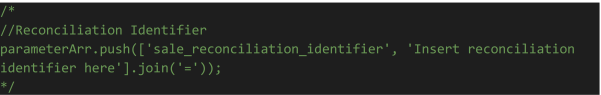

## Creating a New API User

To create a new API user in your AltaPay account, please follow these steps:

- Log in to your AltaPay account.
- From the left menu, navigate to **Settings** > **API Keys**.

    
    
- Click on the **Create New API Key** button from top right corner.
- Fill in the required fields:
    - **Your current password**  
    - **Username**  
    - **Password**  
    - **Assign Shops**
    
    
- After entering the details, click **Create**.

The new credentials can now be used as the API Login and API Password in the AltaPay API Login section.